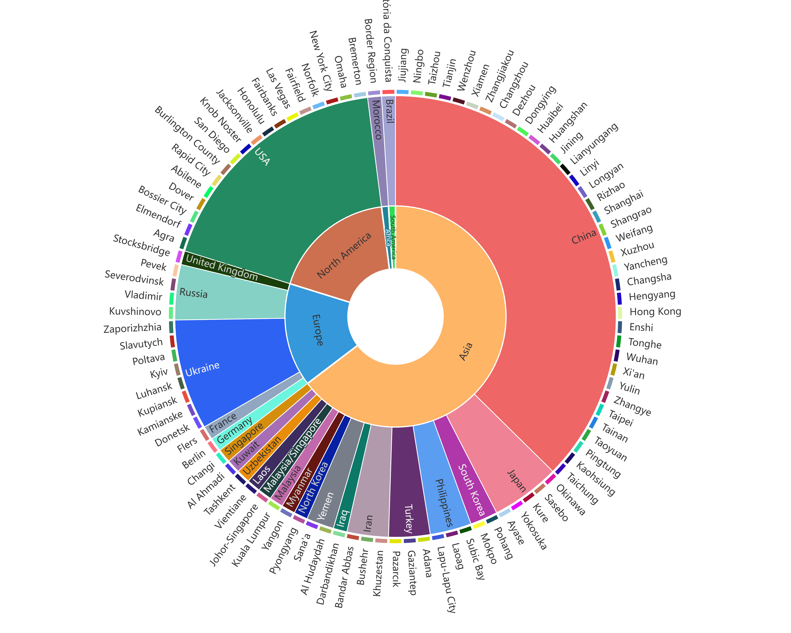
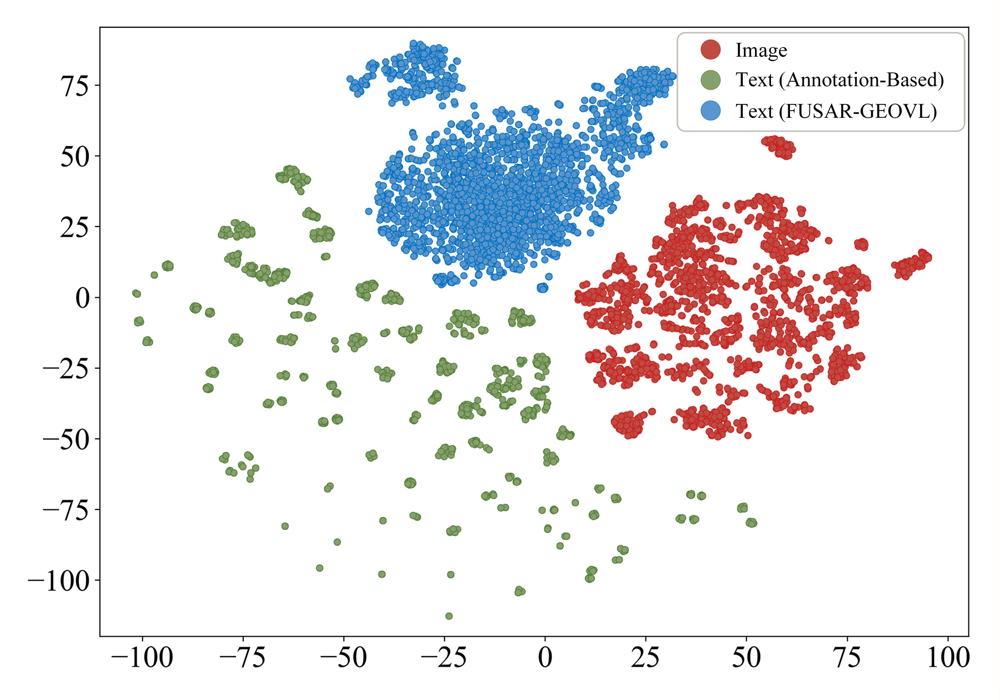
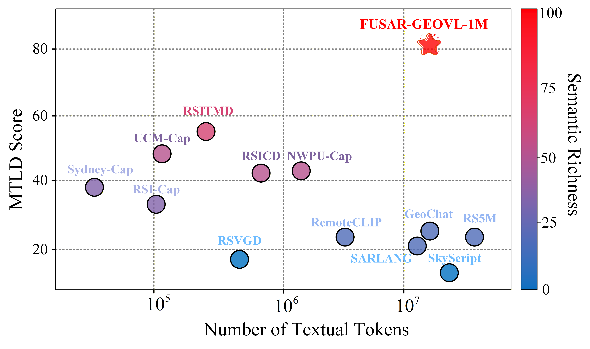
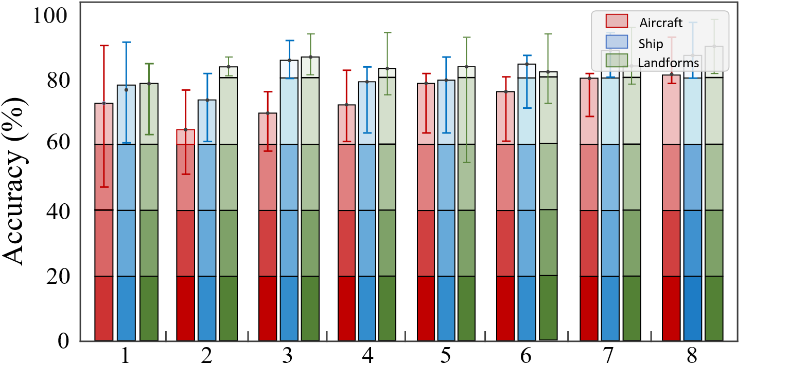
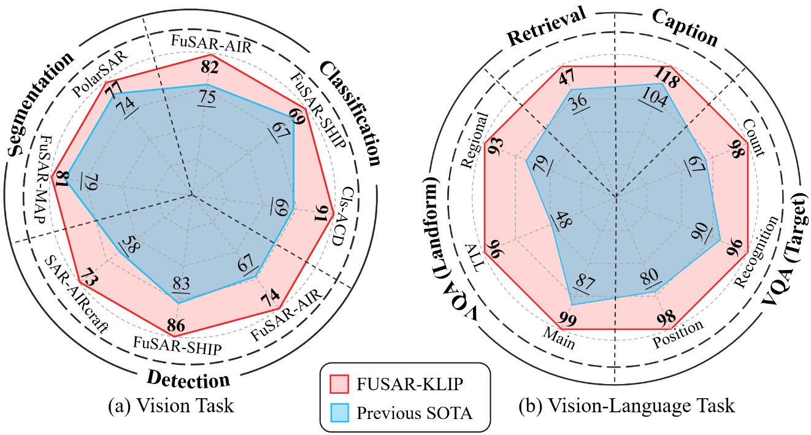

<p align="center">
  
</p>

<h1 align="center">🔥FUSAR-GEOVL-1M & FUSAR-KLIP🔥</h1>


**FUSAR-KLIP** is a knowledge-guided self-supervised multimodal learning framework for SAR (Synthetic Aperture Radar) image interpretation. It introduces hierarchical cognitive reasoning chains to guide large language models in structured SAR image captioning and semantic understanding.[](https://arxiv.org/abs/2509.23927)

---
## 📜 News
* `Notice 🔆 🔆` 15 Dec 2025: The [arXiv paper](https://arxiv.org/abs/2509.23927) of FUSAR-KILP is now online. If you are interested in details of FUSAR-KILP, do not hesitate to take a look!!
* `Impact 🚀 🚀` 25 Oct 2025: Our work has been highly [recommended](https://mp.weixin.qq.com/s/xoEVMc_M1QtgaSHRTqOIwg), reaching **2,000+ views** and **200+ reposts** by scholars within a single day!
---
## 📋 Introduction
Cross-modal artificial intelligence, represented by visual language models, has achieved significant success in general image understanding. However, a fundamental cognitive inconsistency exists between general visual representation and remote sensing image interpretation: remote sensing images couple topography, terrain, and spatial structure, thereby inherently requiring models to possess deep geoscientific understanding. This cognitive difference is further amplified in synthetic aperture radar (SAR) imagery: while SAR possesses irreplaceable all-weather, all-day observation capabilities, it is constrained by coherent imaging mechanisms, exhibiting significant modal heterogeneity with general images. To address this inconsistency, we propose FUSAR-KLIP, the first knowledge-guided general multimodal foundational model for SAR, along with reusable data and evaluation baselines. Specifically: (1) FUSAR-GEOVL-1M (the first large-scale SAR dataset with complete geographic projection attributes) was constructed, covering multiple satellite platforms, 120,000 images, and 135 cities; (2) Aligned structured text was generated through hierarchical cognitive thought chains, accurately encoding more than 1 million multidimensional semantic information from geomorphological environment and regional attributes to spatial relationships; (3) A self-consistent iterative optimization mechanism was designed to guide cross-modal learning with this knowledge information consistent with human cognition and physical laws in a self-supervised closed loop consisting of contrast, matching, and reconstruction; (4) A unified evaluation benchmark was established in 11 typical downstream tasks in the two major categories of vision and language, and compared with 15 mainstream foundation models. Experiments show that FUSAR-KLIP exhibits optimal performance, paving a new path for building remote sensing intelligent systems that are more in line with human cognitive logic. 


## 🔍 Highlights

- **📦 FUSAR-GEOVL-1M Dataset:**  
  The first large-scale SAR image-text dataset with comprehensive geographic metadata. It includes data from **three SAR satellite platforms**, **30 cities**, and **multi-scale scenes**, comprising **120,000+ images** and **1M+ textual descriptions**. It fills a critical gap by providing georeferenced multimodal data for SAR research.

- **🧠 HCoT-Guided Text Generation:**  
  A novel **Hierarchical Chain-of-Thought (HCoT)** instruction system simulates human reasoning to guide large language models. It enables structured, explainable, and scalable annotation without manual intervention.

- **🤖 FUSAR-KLIP Foundation Model:**  
  The first large-scale **vision-language foundational model** tailored for SAR imagery. It leverages **multi-task self-supervised learning** (contrastive, matching, and reconstruction) and introduces a **Self-Consistent Iterative Optimization (SCIO)** module to refine semantic alignment through a closed-loop mechanism of **screening, proofreading, and reconstruction**.

- **🚀 Leading Multi-Task Generalization:**  
  FUSAR-KLIP exhibits **superior performance** across a wide range of downstream tasks—**target classification**, **detection**, **segmentation**, **captioning**, **image-text retrieval**, and **visual question answering**—outperforming existing remote sensing multimodal models in semantic understanding and generalization.

---
## 📦 Dataset: FUSAR-GEOVL-1M
- **(1) Data Overview:**  FUSAR-KLIP is built on **FUSAR-GEOVL-1M**, a large-scale multimodal SAR dataset containing over 100,000 images and 1 million structured textual annotations. This dataset is designed to support geospatially grounded semantic understanding for Synthetic Aperture Radar (SAR) imagery, enabling hierarchical, interpretable, and scalable multimodal learning.

<div align="center">
  
  
  <br/>
  <em>Geographic distribution of FUSAR-GEOVL-1M. </em>
</div>

- **(2) Data construction methods:** we propose a knowledge mining approach guided by HCoT, which emulates the expert reasoning process in SAR interpretation. By progressively integrating multi-source background knowledge and priors, HCoT constructs a structured and controllable cognitive chain, embedded into LLM prompts to enhance text generation quality.

<div align="center">
  
  <br/>
  <em> HCoT (Hierarchical Chain-of-Thought) framework for text generation. This strategy guides large language models to simulate expert reasoning, integrating multi-dimensional knowledge in a structured and interpretable manner.</em>
</div>

- **(3) Text Data Analysis: Examples, Order of Magnitude, Feature Distribution, Accuracy**

<table align="center">
  <tr>
    <td rowspan="3" align="center" width="75%">
      
      <br />
      <em><b>(a) Data generated by the HCoT strategy.</em>
    </td>
    <td align="center" width="25%">
      
      <br />
      <em><b>(b) Text semantic richness and number of tokens.</em>
    </td>
  </tr>
  <tr>
    <td align="center" width="25%">
      
      <br />
      <em><b>(c) The feature distribution is more similar to that of SAR images.</em>
    </td>
  </tr>
  <tr>
    <td align="center" width="25%">
      
      <br />
      <em><b>(d) The accuracy of information from eight dimensions as judged by expert sampling.</em>
    </td>
  </tr>
</table>


---
## 📊 Visual Language Multimodal Learning Methods：FUSAR-KLIP

<div align="center">
  
  <br/>
  <em> Overall framework of the FUSAR-KLIP[code](code/model/Pretrain) .</em>
</div>


---
## 📊 Evaluation

FUSAR-KLIP is benchmarked on a wide range of SAR multimodal tasks, including:

- ✈️ Target classification [code](code/model) [data](data)
- ✈️ Target detection [code](code/model) [data](data)
- 📌 Object segmentation [code](code/model) [data](data)
- 🖼️ Image captioning [code](code/model) [data](data)
- 🔎 Image-text retrieval [code](code/model) [data](data)
- ❓ Visual question answering [code](code/model) [data](data)

The model demonstrates leading generalization capability and semantic alignment across tasks. 
<div align="center">
  
  <br/>
  <em> Performance of vision and vision-language tasks.</em>
</div>

---

## 🧠 The Model Weight

**📌 The model weight will be released soon.**

---

## 📜 Author’s Note

While the Hierarchical Cognitive Chain-of-Thought (HCoT) strategy was designed to enhance textual accuracy in FUSAR-GEOVL-1M by simulating expert reasoning , some factual inconsistencies remain inevitable due to the unique imaging mechanisms of SAR and the inherent limitations of large language models. Our sampling analysis indicates that while the dataset achieves high accuracy in macro-level environmental and terrain descriptions, fine-grained information such as exact target counting may exhibit lower precision. Nevertheless, this dataset serves as a robust resource for self-supervised multimodal pre-training. It effectively bridges the gap in SAR-specific domain knowledge without relying on prohibitive manual annotations, ultimately yielding superior performance across various downstream tasks.

If you find our work helpful for your research, please consider citing our paper and giving this project a ⭐️ on GitHub. Your support is greatly appreciated!
## 📘 Citation
```bibtex
@misc{yang2025fusarklipmultimodalfoundationmodels,
      title={FUSAR-KLIP: Towards Multimodal Foundation Models for Remote Sensing}, 
      author={Yi Yang and Xiaokun Zhang and Qingchen Fang and Jing Liu and Ziqi Ye and Rui Li and Li Liu and Haipeng Wang},
      year={2025},
      eprint={2509.23927},
      archivePrefix={arXiv},
      primaryClass={cs.CV},
      url={https://arxiv.org/abs/2509.23927}, 
}


