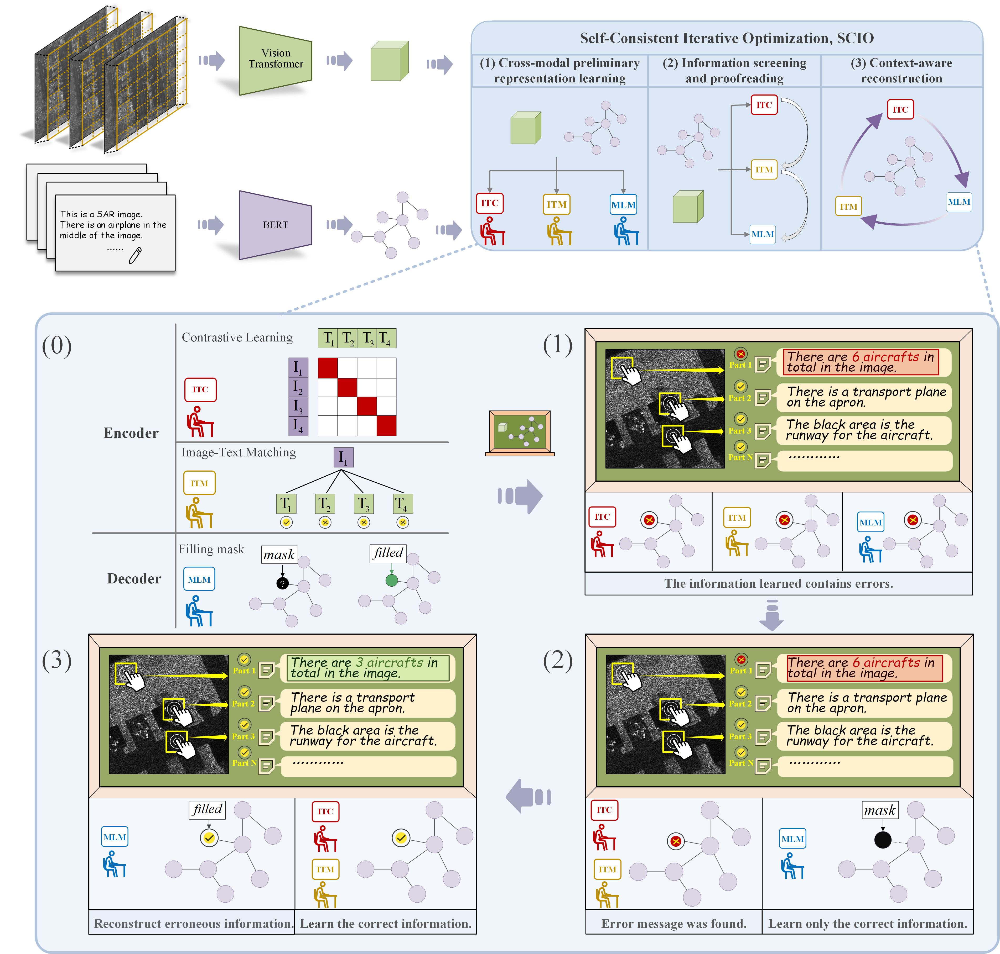
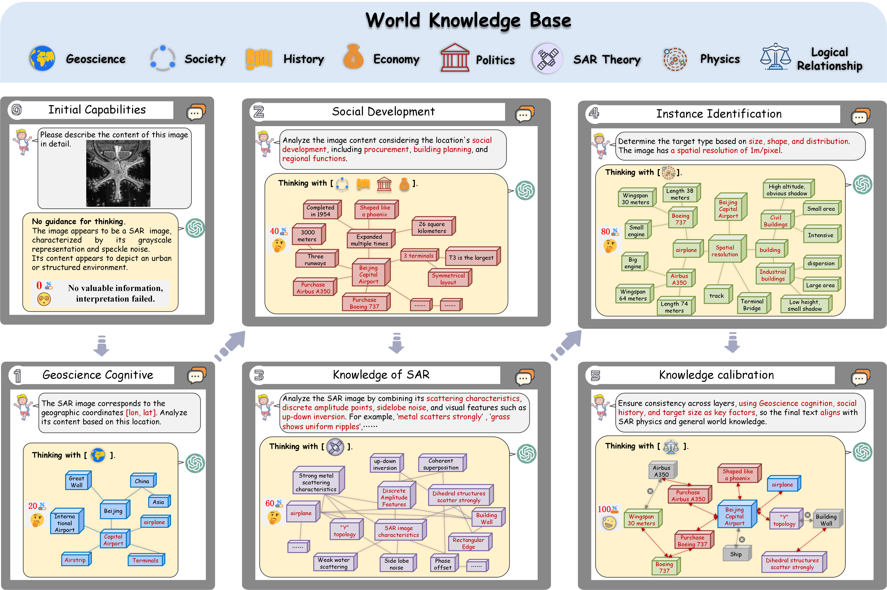
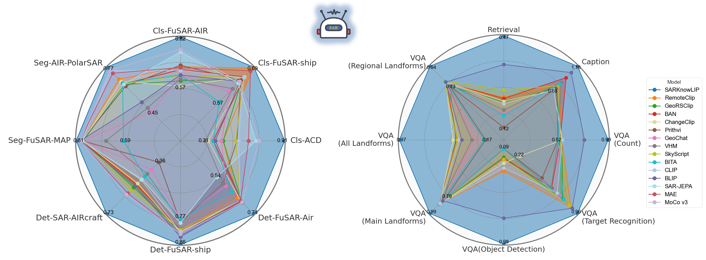

  

<h1 align="center">FUSAR-GEOVL-1M & FUSAR-KLIP</h1>

**FUSAR-KLIP** is a knowledge-guided self-supervised multimodal learning framework for SAR (Synthetic Aperture Radar) image interpretation. It introduces hierarchical cognitive reasoning chains to guide large language models in structured SAR image captioning and semantic understanding.

---

## 📊 Overview

  
   
  <em>Figure 1: Overall framework of the FUSAR-KLIP .</em>

---

## 🔍 Highlights

- **📦 FUSAR-GEOVL-1M Dataset:**  
  The first large-scale SAR image-text dataset with comprehensive geographic metadata. It includes data from **three SAR satellite platforms**, **30 cities**, and **multi-scale scenes**, comprising **120,000+ images** and **1M+ textual descriptions**. It fills a critical gap by providing georeferenced multimodal data for SAR research.

- **🧠 HCoT-Guided Text Generation:**  
  A novel **Hierarchical Chain-of-Thought (HCoT)** instruction system simulates human reasoning to guide large language models. It enables structured, explainable, and scalable annotation without manual intervention.

- **🤖 FUSAR-KLIP Foundation Model:**  
  The first large-scale **vision-language foundational model** tailored for SAR imagery. It leverages **multi-task self-supervised learning** (contrastive, matching, and reconstruction) and introduces a **Self-Consistent Iterative Optimization (SCIO)** module to refine semantic alignment through a closed-loop mechanism of **screening, proofreading, and reconstruction**.

- **🚀 Leading Multi-Task Generalization:**  
  FUSAR-KLIP exhibits **superior performance** across a wide range of downstream tasks—**target classification**, **detection**, **segmentation**, **captioning**, **image-text retrieval**, and **visual question answering**—outperforming existing remote sensing multimodal models in semantic understanding and generalization.

---
## 📦 Dataset: FUSAR-GEOVL-1M

FUSAR-KLIP is built on **FUSAR-GEOVL-1M**, a large-scale multimodal SAR dataset containing over 100,000 images and 1 million structured textual annotations. This dataset is designed to support geospatially grounded semantic understanding for Synthetic Aperture Radar (SAR) imagery, enabling hierarchical, interpretable, and scalable multimodal learning.

  
   
  <em>Figure 2: Geographic distribution of FUSAR-GEOVL-1M. The dataset covers 30 representative cities and includes data collected from three major satellite platforms, ensuring a wide diversity of regional characteristics and imaging conditions.</em>

  
   
  <em>Figure 3: Distribution of semantic text annotations. Each SAR image is paired with eight structured text prompts that describe targets, terrain, and scene attributes at multiple semantic levels.</em>

  
   
  <em>Figure 4: HCoT (Hierarchical Chain-of-Thought) framework for text generation. This strategy guides large language models to simulate expert reasoning, integrating multi-dimensional knowledge in a structured and interpretable manner.</em>

---

## 📊 Evaluation

FUSAR-KLIP is benchmarked on a wide range of SAR multimodal tasks, including:

- ✈️ Target classification & detection
- 📌 Object segmentation
- 🖼️ Image captioning
- 🔎 Image-text retrieval
- ❓ Visual question answering

The model demonstrates leading generalization capability and semantic alignment across tasks. 

  
   
  <em>Figure 5: Performance of vision and vision-language tasks.</em>

---

## 📁 Dataset Download

The FUSAR-GEOVL-1M dataset will be made publicly available soon.

---

## 🧠 Model: FUSAR-KLIP

**📌 The model weight will be released soon.**

---

